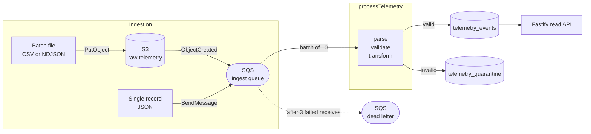

# Drone Telemetry Pipeline

An event-driven pipeline that ingests telemetry from a fleet of autonomous
delivery drones, validates it, and stores it in a shape that answers the
questions an operations team actually asks.

A file lands in S3 or a message lands on a queue. Nothing polls, and nothing
runs on a schedule. Every record either becomes a row in `telemetry_events` or a
row in `telemetry_quarantine` with the reason attached. There is no third
outcome, and no way for one corrupt record to affect its neighbours.

**Status:** 129 unit tests and 23 integration tests, all passing. The Pulumi program is
typechecked but not deployed. See
[Honesty about what is and is not proven](#honesty-about-what-is-and-is-not-proven)
for exactly what has been run and what has not.

---

## Architecture



The same `processTelemetry` function runs in both deployments. In AWS it is a
Lambda behind an SQS event source mapping; locally it is a long-lived Node
process polling the same queue. Neither runtime file contains a line of
pipeline logic.

---

## Quickstart

Requires Docker and Node 22+.

```bash
npm install
docker compose up --build        # Postgres, MinIO, ElasticMQ, migrations, processor, API
npm run send:file                # upload the sample batches to S3
```

Watch the processor logs. Then:

```bash
# Valid events for one drone
curl -s "http://localhost:3000/drones/DRONE-001/events?limit=5" | jq

# Errors in a time window
curl -s "http://localhost:3000/events/errors?limit=5" | jq

# What failed validation, and why
curl -s "http://localhost:3000/quarantine?limit=5" | jq
```

Two more things worth trying, because they demonstrate the parts of the design
that are hard to see from the code alone:

```bash
npm run send:message             # a record posted straight to the queue, no S3
npm run send:file -- corrupt     # 13 rows, one per failure mode
npm run send:file -- corrupt     # run it AGAIN: 0 inserted, 6 duplicates
```

That last repetition is the point. Re-uploading the same data inserts nothing,
because the pipeline is idempotent. Run `npm run seed` for a synthetic batch of
2000 records at a size where the numbers in the logs start to mean something.

Tests:

```bash
npm run test:unit                # ~700ms, no Docker required
npm run test:integration         # real Postgres via Testcontainers
```

---

## Design decisions

### Why a queue between S3 and the processor

S3 can invoke a Lambda directly, and that would be one fewer resource. The queue
earns its place three times over:

- **Buffering.** Drone fleets are bursty. The queue absorbs a spike so that a
  slow database throttles processing rather than breaking ingestion.
- **Retry with a boundary.** SQS gives per-message retry and a dead-letter queue
  after `maxReceiveCount`. Direct S3 invocation gives you retries with no
  natural place for a message that will never succeed.
- **Backpressure.** `maximumConcurrency` on the event source mapping is the
  valve that stops the pipeline overwhelming its own database. Without a queue
  there is nothing to hold the work while you refuse to scale.

### Why ports and adapters

The core (`src/core/`) is pure: no database, no network, no AWS SDK. It takes
data and returns data. The handler depends on three narrow interfaces
(`EventStore`, `ObjectStore`, `Logger`), and the only file that knows a real
Postgres exists is `src/runtime/dependencies.ts`.

Three things fall out of that, and they are the reason it was worth the extra
indirection:

1. **The tests need no mocking library.** 129 unit tests, no Docker, no network,
   under a second. The in-memory `EventStore` is 40 lines.
2. **The transport became a detail.** Supporting both a Lambda and a local
   poller cost about 60 lines each, because neither contains any logic.
3. **Swapping the database is a change to one file.** That is not hypothetical
   here, given the argument below.

### Why Postgres, and the honest case for DynamoDB

**Chosen: Postgres**, with typed columns for the fields that get queried and a
`JSONB` column for the ones that do not.

DynamoDB is the more obviously "serverless" answer and it has a real argument
that Postgres cannot match: **the connection model**. Every concurrent Lambda
invocation is its own process with its own connection pool, so unbounded scaling
against RDS exhausts `max_connections` and the pipeline takes down its own
database. DynamoDB is stateless over HTTP and simply does not have this problem.
That is a genuine architectural advantage, not a detail.

Postgres won anyway, for four reasons:

- **The access patterns are relational and known.** "Events for a drone in a
  window" and "errors in a window" are two indexed queries. A composite index
  and a partial index serve them exactly, and the query planner proves it in
  `tests/integration/queries.test.ts`.
- **The queries that have not been thought of yet.** Telemetry gets analysed, and
  analysis is by definition ad hoc: correlating battery drain against altitude
  across a fleet is a `GROUP BY` in Postgres and an export-to-somewhere-else in
  DynamoDB. Freezing the access patterns at design time is the cost of a
  single-table design, and it is the wrong cost to pay for data whose whole
  purpose is to be questioned later.
- **Idempotency is one line.** A `UNIQUE` constraint plus
  `ON CONFLICT DO NOTHING` is correct under concurrency with no application
  logic and no distributed lock. DynamoDB gets there with a conditional write,
  which is also fine, but not simpler.
- **`JSONB` gives most of the schema flexibility anyway.** New telemetry fields
  land without a migration, and remain queryable through a GIN index.

The connection problem is then solved directly rather than ignored:
`maximumConcurrency: 10` on the event source mapping, a deliberately small pool
per process, and RDS Proxy named as the next step when that cap becomes the
bottleneck. **This is the decision I would most expect to be challenged on, and
I would change it** if the workload were write-heavy at a scale where a single
Postgres writer was the limit, or if the query patterns were genuinely fixed.

### Schema: model what you query, keep the rest

```
telemetry_events
  event_id     TEXT UNIQUE    -- idempotency key
  drone_id     TEXT
  event_time   TIMESTAMPTZ
  event_type   TEXT
  status_code  INTEGER
  severity     TEXT           -- derived: info | warning | error
  battery_pct  NUMERIC(5,2)   -- promoted out of telemetry
  latitude     DOUBLE PRECISION
  longitude    DOUBLE PRECISION
  telemetry    JSONB          -- everything else the drone sent
  raw          JSONB          -- the original record, verbatim
  source       TEXT           -- s3://bucket/key#L42
  ingested_at  TIMESTAMPTZ
```

A column per field would force a migration every time a new sensor ships.
Everything in `JSONB` would make the two queries that matter slow and
awkward. So: model what you query, keep the rest.

Three fields deserve a note:

- **`severity` is derived at write time**, not computed at read time. It turns
  "show me the errors" into one indexed predicate instead of a growing list of
  `OR` conditions that has to be updated in every query whenever a new failure
  event type appears.
- **`raw` keeps the original record.** Cheap insurance. If a transform bug is
  found in six months, the fix is a `SELECT` and an `UPDATE` rather than asking
  the fleet to resend data it no longer has.
- **`source` records provenance down to the line number**, so a bad batch is
  traceable back to the file and row it came from.

Each index carries a comment in
[`migrations/001_telemetry_events.sql`](migrations/001_telemetry_events.sql)
naming the query it serves:

| Index | Serves |
|---|---|
| `(drone_id, event_time DESC)` | "All events for a specific drone", with no sort step |
| `(event_time DESC) WHERE severity = 'error'` | "All errors in a time window". Partial, so it indexes ~5% of rows and stays cache-resident |
| `GIN (telemetry jsonb_path_ops)` | Ad-hoc filtering on fields that were never promoted to columns |

`tests/integration/queries.test.ts` runs `EXPLAIN` against 5000 analysed rows and
asserts each query uses its intended index. An index the planner ignores costs
write throughput and disk while buying nothing, and nothing else in a test suite
would notice.

### Idempotency, because at-least-once means duplicates are routine

SQS guarantees at-least-once delivery, not exactly-once. S3 can emit the same
notification twice. A retried batch reprocesses records that already landed.
Duplicates are the normal case, not the exceptional one, and double-counting
deliveries corrupts every downstream metric.

Every record gets an `event_id`:

- If the drone supplies one, it is trusted. The fleet is the only party that can
  distinguish two genuinely different events with identical content.
- Otherwise it is derived: `sha256(droneId | timestamp | eventType | statusCode | canonicalJson(telemetry))`.

Insertion is `ON CONFLICT (event_id) DO NOTHING`, so uniqueness is enforced by
the database rather than by a read-then-write check in the application. That
matters under concurrency: two Lambdas processing the same redelivered message
race at the constraint and exactly one wins, with no distributed lock. The row
count difference gives the duplicate count for free.

**The canonicalisation is load-bearing, and a test proved it.**
`{"lat":1,"lon":2}` and `{"lon":2,"lat":1}` are the same reading and must hash
identically. So must `"120"` from a CSV cell and `120` from a JSON message.
A test asserting that the same record produces the same `event_id` through both
ingestion paths **failed** on exactly that: unmodelled telemetry fields survived
as strings from CSV and as numbers from JSON, so the identical reading hashed
two different ways and would have been stored twice. Telemetry scalars are now
type-normalised, conservatively: `"0.0"` and `"-5.93"` become numbers, `"007"`
stays a string, because turning a zero-padded serial number into an integer is a
worse bug than leaving a number as text.

**The accepted trade-off:** without a drone-supplied id, two genuinely distinct
events from the same drone, in the same millisecond, of the same type, with
identical telemetry, are indistinguishable and one is dropped. That is the right
way round. Losing a true duplicate-looking event is recoverable; silently
double-counting deliveries is not.

### Bad data is quarantined. Broken infrastructure is retried.

This is the single most important error-handling decision in the service, and
the two failure modes are deliberately kept apart:

| | Example | What happens |
|---|---|---|
| **Bad data** | Missing `droneId`, battery of 4000, malformed CSV row | Row written to `telemetry_quarantine` with the reason. **Message acknowledged.** |
| **Broken infrastructure** | Postgres unreachable, S3 returning 503 | **Message returned for retry.** After 3 receives, the DLQ. |

Conflating them is how these pipelines fail in practice. Retry a malformed
record and it fails identically every time, burns its retries, and lands in the
DLQ, where it sits alongside the real outages and hides them. A DLQ full of
records that can never succeed is a DLQ nobody looks at, and the alarm on it
stops meaning anything.

Because bad data never reaches the DLQ here, "anything in the DLQ" is a
meaningful alarm condition, which is exactly how it is wired in
[`infra/index.ts`](infra/index.ts).

`raw_payload` in the quarantine table is deliberately `TEXT`, not `JSONB`: the
premise of the table is that the payload may be corrupt, and `JSONB` would
reject exactly the rows worth preserving. Errors are stored as structured
`JSONB`, so "which field fails most often" is a query rather than a grep, and
that question usually points straight at a firmware bug on one drone model.

### Unknown event types are kept, not rejected

An `eventType` the pipeline has never seen is stored as `UNKNOWN`, with the
original value preserved in `raw`.

Firmware ships new event types faster than a data pipeline can be redeployed. A
validator that rejects anything it has not been taught about silently discards
real data until somebody notices, and by then the data is gone. Keeping the
record means a later backfill is a SQL `UPDATE`, not an apology to the fleet
operations team. The same reasoning applies to unrecognised fields inside
`telemetryData`, which pass through into the `JSONB` column untouched.

### One log line per batch, not per record

Logs are structured JSON, because they are read by CloudWatch Logs Insights
rather than by a human tailing a terminal. `{"droneId":"D1"}` is queryable;
`"processing drone D1"` is a regex problem.

The processor emits **one summary line per message** with counts and duration,
not one line per record. At fleet scale, per-record logging costs more to ingest
and store than the pipeline costs to run, and the signal disappears into it.
Individual bad records stay fully traceable through the quarantine table and its
`source` column, which is the right place for that detail. A batch where *every*
record failed validation does get a `warn`, because that is a contract problem
rather than a data problem.

### Why Pulumi

It is what ScreenCloud uses, and it keeps infrastructure in the same language
and the same review process as the application.

The alternative worth naming is the Serverless Framework, which would express
the function and its event source in fewer lines. It has much less to say about
the bucket policy, the queue redrive policy, and the IAM boundaries, and those
are where the interesting decisions in this stack live. Terraform would be an
equally good answer; the deciding factor was matching the team.

Permissions were treated as a design surface rather than paperwork. Every
statement names a specific resource ARN, and **there is no `"Resource": "*"`
anywhere in the stack**. The processor can read the raw bucket but not write to
it, so a bug cannot destroy the archive that makes replay possible. It can
consume the queue but not publish to it. S3's permission to publish is a
resource policy on the queue, scoped with `aws:SourceArn` so that no other
bucket in the account can use it. Full breakdown in
[`infra/README.md`](infra/README.md).

### The local stack, and why it is not LocalStack

The obvious choice for local AWS is LocalStack, and this was built on it.
**LocalStack retired its free community image on 23 March 2026**, and every
image now requires an auth token. That turns `docker compose up` into "first,
go and create an account", which is not a reasonable thing to ask of someone
reviewing a repository.

So the local stack is **MinIO** for S3 and **ElasticMQ** for SQS. Both are open
source, need no account, and have been around long enough to be dull, which is
the quality that matters most in a dependency whose entire job is to start
reliably on someone else's machine. Both speak the real AWS APIs, so the S3 and
SQS adapters are exercised locally rather than stubbed.

**One thing is genuinely lost, and it is worth being clear about it.** MinIO can
emit bucket notifications to a webhook, Kafka or Redis, but not to an SQS queue.
So locally, `npm run send:file` publishes the `ObjectCreated` event that S3
publishes for itself in AWS. The message is the real S3 event shape, with keys
URL-encoded exactly as S3 encodes them (spaces as `+`), so the handler cannot
tell the difference and its decoding path is genuinely exercised. What is not
proven locally is the bucket-notification wiring itself, which lives in
`infra/index.ts` and would only be proven by a deploy.

`docker-compose.localstack.yml` runs the original topology for anyone who does
have a LocalStack token, and that version does exercise the S3 trigger natively.

This also forced a small improvement. Because a local queue server advertises
URLs on a hostname only resolvable inside the Docker network, the queue is now
identified by **name** and its URL resolved at runtime via `GetQueueUrl`, with
the endpoint's host applied to the result. Hardcoding a queue URL couples the
application to one provider's formatting; resolving by name means the same
configuration works everywhere.

---

## The data contract

Both ingestion paths accept the same record shape. Only `droneId`, `timestamp`
and `eventType` are required.

```json
{
  "eventId": "optional-firmware-supplied-id",
  "droneId": "DRONE-001",
  "timestamp": "2026-09-01T10:00:00Z",
  "eventType": "DELIVERY_COMPLETED",
  "statusCode": 200,
  "telemetryData": {
    "batteryPct": 87.5,
    "lat": 54.597,
    "lon": -5.93,
    "altitudeM": 90,
    "anythingElse": "is kept"
  }
}
```

The schema is **lenient about representation and strict about meaning**. A
battery level of `"87.5"` from a CSV cell and `87.5` from a JSON message are the
same fact and both are accepted; `4000` is not a fact at all and is rejected.

| Field | Accepted | Rejected |
|---|---|---|
| `timestamp` | ISO 8601, epoch seconds, epoch milliseconds, numeric strings | Unparseable, before 2020, more than 24h in the future |
| `eventType` | Any string. Case and separators normalised (`delivery completed` to `DELIVERY_COMPLETED`) | Empty or missing |
| `statusCode` | Number or numeric string. Empty means absent | Non-numeric text |
| `batteryPct` | Number or numeric string, 0 to 100 | Outside that range |
| `lat` / `lon` | Number or numeric string, valid coordinate ranges | Outside those ranges |
| `telemetryData` | Object, or a JSON string (as CSV gives it). Unknown fields kept | A string that is not JSON |

Both timestamp epochs are supported because firmware in the wild emits both, and
guessing wrong files a 2026 event under 1970. Values below `1e11` are read as
seconds and above as milliseconds; no plausible real timestamp is ambiguous.

**Input formats:** CSV (flat columns, with unrecognised columns nested under
`telemetryData` automatically), NDJSON, and JSON (single object or array).
Format is taken from the file extension, falling back to content sniffing.

**Timestamps that are out of range are rejected rather than clamped.** A drone
reporting the year 2099 has a clock fault, and storing it would quietly corrupt
every time-window query for as long as it went unnoticed.

---

## Testing

```
tests/unit/          129 tests, ~200ms, no Docker
tests/integration/    23 tests, real Postgres via Testcontainers (needs Docker)
```

The split is deliberate. The unit suite is fast enough to run on every save
because the core is pure: there is nothing to mock, so there are no mocks. The
in-memory `EventStore` is 40 lines and reproduces the one behaviour the handler
depends on, the `UNIQUE` constraint. **A double that accepted duplicates would
let an idempotency bug pass its own test**, which is the classic way a test
double makes a suite worse rather than better.

What the unit tests cover, beyond the obvious: ragged CSV rows, embedded
newlines inside quoted fields, BOMs, CRLF, epoch-versus-ISO timestamps, empty
CSV cells that must not become zeros, out-of-range readings, hostile payloads
that must not throw, and the S3 `TestEvent` that AWS fires when a bucket
notification is created.

### Integration testing

Testcontainers starts a real Postgres per test file, using the same image the
Compose stack uses so the test and dev environments cannot silently diverge. The
tests then assert the properties a mock cannot reach:

- `ON CONFLICT DO NOTHING` genuinely deduplicates, and reports the right counts
- The `CHECK` constraints reject impossible data (the second line of defence,
  for when somebody writes a backfill script and skips the pipeline)
- Batches larger than the chunk size do not exceed Postgres's 65535 bind
  parameter limit
- **`EXPLAIN` confirms each query uses its intended index**, and the partial
  errors index really is a fraction of the size of a full one
- Keyset pagination walks the full result set with no duplicates and no gaps
- Migrations are idempotent

### Guards that are not tests

`npm run check:deps` compiles the application and asserts that every module it
imports at runtime is declared in `dependencies` rather than `devDependencies`.

It exists because that exact mistake took the local stack down: the runtime
image installs with `--omit=dev`, so a dev dependency reached for at runtime is
simply absent and the container crash-loops. Typecheck could not see it, because
the package is installed in development. The tests could not see it, because
they run with everything installed. It is only visible at the boundary between
the dependency graph and the deployment.

It reads the compiled output rather than the source, because `import type` is
erased at compile time and is therefore safe, and only the compiled output knows
the difference. It runs in CI on every push, and it has been verified by
reintroducing the original bug and watching it fail.

### What I would add next

- **A real end-to-end test.** Put a file in S3, wait for the row to appear in
  Postgres, assert it. The local stack does this by hand today but nothing
  automates it, and it would catch wiring mistakes no unit test can: a wrong
  queue name, a missing IAM permission, an S3 key that arrives URL-encoded.
  This is the biggest gap in the suite.
- **Contract tests against a published schema.** Currently the drone firmware
  and this pipeline agree on a shape by convention. A shared JSON Schema, with
  both sides testing against it, would turn a production incident into a failing
  build.
- **Load testing.** Every throughput number in this README (batch sizes, memory,
  concurrency cap, chunk size) is a considered starting point, not a measured
  one. They should be tuned against a realistic replay.
- **Property-based tests on the parser**, generating malformed CSV to assert the
  invariant that it never throws and never loses a row.

---

## Assumptions

1. **Batch files fit in memory.** `getObjectText` reads a whole object. Fine at
   the sizes here; a multi-gigabyte upload would need a streaming read, and
   `MAX_RECORDS_PER_OBJECT` (default 50,000) is a deliberate ceiling so a
   hostile or accidental upload cannot exhaust the processor rather than a
   claim that larger files work.
2. **Drone clocks are roughly correct.** Timestamps outside 2020 to 24 hours
   from now are treated as clock faults. A fleet with genuinely unreliable
   clocks would need `ingested_at` as the primary time axis instead.
3. **Late-arriving data is acceptable.** A drone that buffers offline and
   uploads a day later is stored with its original `event_time`, which is
   correct for analysis but means a dashboard reading "errors in the last hour"
   can change retrospectively.
4. **Ingestion is trusted at the network boundary.** Anything that can write to
   the bucket or the queue is assumed to be an authorised drone gateway. There
   is no per-drone authentication or signature verification.
5. **`droneId` is opaque.** No fleet registry is consulted, so telemetry from a
   decommissioned or spoofed drone is stored like any other.
6. **Errors are a minority of traffic.** The partial index on `severity =
   'error'` pays for itself at roughly 5% errors and stops doing so if errors
   became the common case.
7. **One region, one database.** No multi-region replication or failover.

## Honesty about what is and is not proven

Worth being explicit, because "it works" should mean something specific.

**Run, and green:**

- The 129 unit tests. All core logic, and the handler including every failure
  path, against in-memory doubles.
- The 23 integration tests, against a real Postgres started by Testcontainers.
  These earned their keep: they caught a bug where NUMERIC columns came back as
  strings, because the type parser correcting that was registered as a side
  effect of importing a module the test helper never imported. The read API
  would have served `{"battery_pct": "87.50"}` in production and no unit test
  could have seen it.
- Typecheck and lint across the application, the scripts and the Pulumi program.
- The Lambda bundle: built with esbuild, then loaded and invoked with a
  synthetic `SQSEvent` against an unreachable database, confirming it exports a
  callable handler and returns the correct `batchItemFailures` rather than
  throwing.
- The pipeline against every sample file, with the results asserted in
  `tests/unit/sample-data.test.ts`.

**Partly verified:** the Compose stack built cleanly and Postgres migrations
applied, but the object storage and queue services were replaced after that run
(see [The local stack](#the-local-stack-and-why-it-is-not-localstack)) and the
end-to-end walkthrough has not been repeated since.

**Not verified, and would not be without an account:** the Pulumi program is
typechecked but **has not been deployed to real AWS**. Some things only fail on
a real deploy: an IAM policy that is one action too tight, an RDS parameter the
API rejects, a VPC route that does not exist. I would expect a first deploy to
need one or two fixes.

**Known gap:** the local topology is defined separately from the AWS one, in
`docker-compose.yml` and `docker/elasticmq.conf` rather than in
`infra/index.ts`. That is real duplication and it can drift. It is there so
`docker compose up` works with no Pulumi install and no cloud account. The
values that matter are kept deliberately identical and commented as such:
`maxReceiveCount` of 3 and a 60 second visibility timeout appear in both.

## Where I would go next

In the order I would actually do them:

1. **Deploy it.** Everything above is theory until an IAM policy is rejected by
   the real thing.
2. **RDS Proxy.** `maximumConcurrency: 10` is a cap that trades throughput for
   safety. RDS Proxy pools connections outside the Lambda, which removes the
   trade rather than managing it, and is the standard answer to Lambda plus
   Postgres.
3. **Streaming reads for large objects.** Replace `getObjectText` with a stream
   through a streaming CSV parser. The `ObjectStore` port already isolates this
   to one adapter.
4. **Partition `telemetry_events` by month.** Time-series tables grow without
   bound, and unpartitioned they eventually make both vacuum and time-range
   queries painful. `pg_partman` with a monthly range and automatic detachment
   to cold storage.
5. **Alarm on quarantine rate, not just the DLQ.** A firmware release that
   breaks a field would show up as a quarantine spike while every AWS metric
   stayed green. That is the outage this design would currently miss.
6. **Per-drone authentication** at the ingestion boundary.
7. **A replay tool.** The raw archive in S3 makes replay possible; there is no
   command to do it yet. Reprocessing a date range should be one command, and it
   is safe to run because the pipeline is idempotent.

---

## Project structure

```
src/
  core/          Pure. No I/O. parse, validate, transform, pipeline.
  ports/         The interfaces the handler depends on.
  adapters/      Implementations: postgres, s3, pino, and in-memory doubles.
  handlers/      processTelemetry. Knows nothing about Lambda or SQS.
  runtime/       Entry points: lambda, poller, api, and the composition root.
migrations/      Numbered SQL, each index commented with the query it serves.
infra/           Pulumi program. See infra/README.md.
tests/           unit (no Docker) and integration (Testcontainers).
sample-data/     Clean and deliberately corrupt batches. See sample-data/README.md.
scripts/         Seed generator, sample uploader, Lambda bundler, LocalStack init.
```

## Configuration

Copy `.env.example` to `.env` to run the scripts, processor or API on the host;
Compose sets these for the containers. The variables worth knowing are
**`S3_ENDPOINT_URL`** and **`SQS_ENDPOINT_URL`**: set to the local servers
locally, unset in a real deployment so the SDK resolves real AWS. They are the
entire difference between the two runtimes.

The queue is identified by **name**, not URL. The URL is resolved at runtime via
`GetQueueUrl`, so the same configuration works against real SQS and against a
local queue server whose URL format is its own business.

Configuration is parsed and validated with Zod at boot, so a missing or
malformed variable fails immediately with a readable message rather than
surfacing as `undefined` in a connection string three minutes into a batch.

`LOG_PRETTY` is worth one line of explanation, because getting it wrong broke
the Compose stack. Pretty printing is a property of **who is reading**, not of
**where the code runs**. It was originally inferred from "are the endpoint
overrides set", meaning any local run got the pretty transport, including
containers, which do not install it and do not want it: nobody watches a
container's stdout, something else parses it. It is now its own flag, off by
default, and asking for it where it is unavailable degrades to JSON rather than
crashing. A logging preference should never be worth a crash loop.

---

## A note on AI usage

The brief encourages AI use and asks that it can be explained, so:

This was built with Claude in a planning-first workflow. I spent the first phase
on architecture and technology choices rather than code, working through options
with trade-offs for each of: ingestion mechanism, database, validation library,
database access layer, and IaC tool. The decisions recorded in this README are
the ones I chose and can defend, including the ones where I picked against the
AI-suggested default.

The commit history is granular on purpose, and each message records why a change
was made rather than what changed. Commits are co-authored, which seemed more
honest than quietly stripping the attribution.

Where it was most useful: AWS specifics I have not memorised (SQS redrive
semantics, `ReportBatchItemFailures`, the `aws:SourceArn` confused-deputy
condition) and generating the breadth of edge-case tests quickly.

Where the judgement was mine: each significant choice was put to me as options
with trade-offs rather than a default, and I picked. Postgres over DynamoDB
knowing the connection-model argument cuts the other way. Raw SQL over an ORM,
because the thing being assessed here is whether I understand the database, and
an ORM hides exactly that. A local poller rather than emulating Lambda in
an emulator, because the handler is byte-identical either way, so emulation adds
a flaky moving part and proves nothing extra.

I am a frontend engineer by background, and several of these were genuinely new
to me. I would rather say that than pretend otherwise, and I can explain every
one of them, which was the point of working this way.

The most valuable thing it did was catch a bug I would not have found by
inspection. A test asserting that CSV and JSON ingestion produce the same
`event_id` failed, revealing that unmodelled telemetry values arrived as strings
from one path and numbers from the other, so identical readings hashed
differently and would have been stored twice. That is written up in the
[idempotency section](#idempotency-because-at-least-once-means-duplicates-are-routine).
